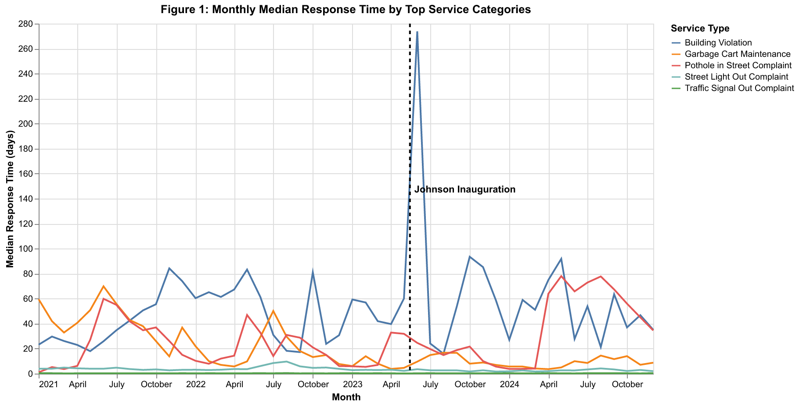
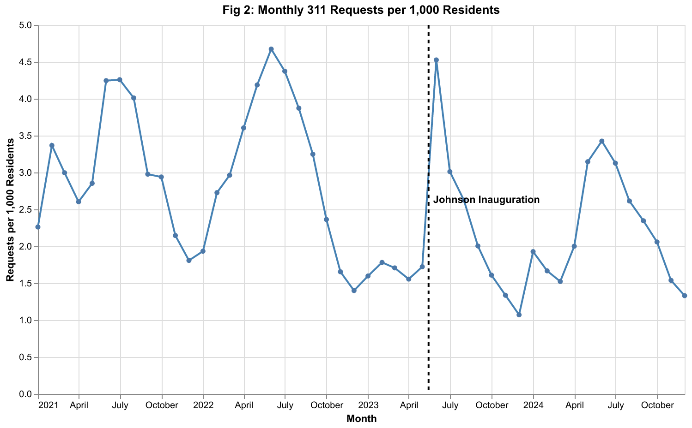
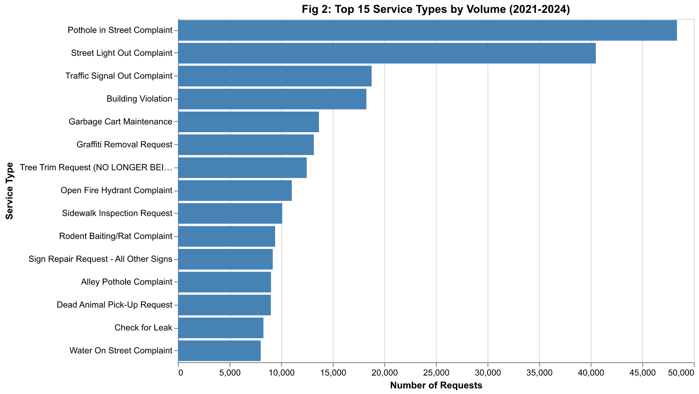
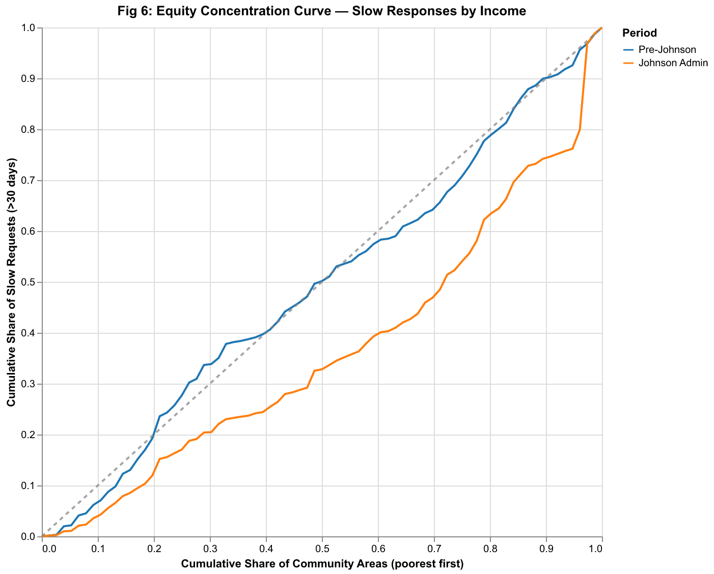
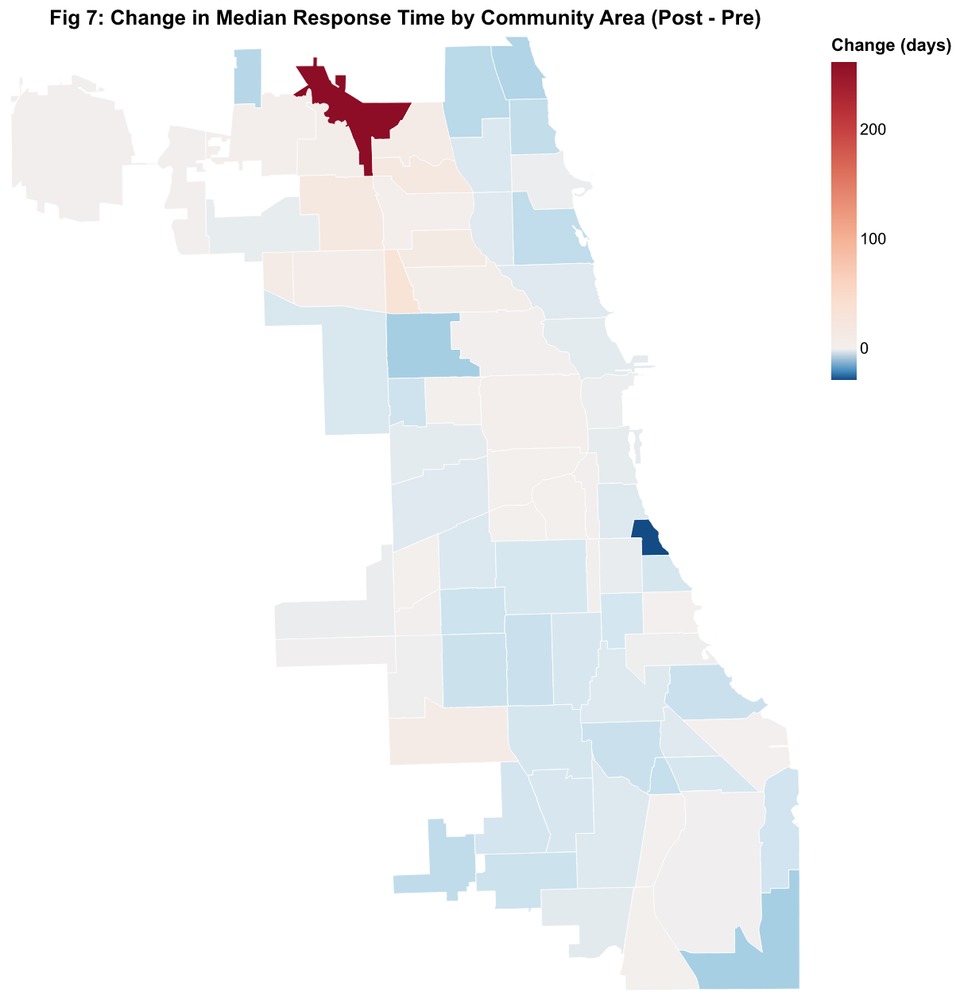

## Research Question

City governments rely heavily on administrative data to monitor operational performance and ensure equitable service delivery. In Chicago, 311 service requests provide a detailed, high-frequency record of resident demand for city services and the speed at which those services are resolved across neighborhoods.

This project analyzes how patterns in Chicago's 311 service delivery evolved between January 2021 and December 2024, spanning the period prior to and during Mayor Brandon Johnson's administration (inaugurated May 15, 2023). We focus on four descriptive questions:

1. How did overall demand for city services change between 2021 and 2024?
2. Did service response times shift in level, trend, or variability around the mayoral transition?
3. How did disparities in service delivery across neighborhoods---particularly by income level---evolve over time?
4. Which service categories contributed most to observed changes?

The analysis is intentionally descriptive rather than causal.

## Approach and Coding

**Data sources.** We combine two publicly available datasets:

- **Chicago 311 Service Requests** from the City of Chicago Data Portal (Socrata API), containing request dates, completion dates, service categories, and geolocation for all requests from 2021--2024 (326,139 records).
- **American Community Survey (ACS) 5-Year Estimates** from the U.S. Census Bureau, providing population, median household income, and poverty rates at the census-tract level for Cook County (1,332 tracts).

We also use **Chicago Community Area Boundaries** (GeoJSON) from the Data Portal for spatial aggregation.

**Data wrangling.** All processing is handled in `code/preprocessing.py`. Key steps include: (i) filtering the 311 dataset to the 2021--2024 study period; (ii) computing response times in days from created and closed dates; (iii) spatial-joining 311 requests to Chicago's 77 community areas using latitude/longitude coordinates; (iv) aggregating ACS census tract data to the community area level via centroid-based spatial joins; and (v) constructing income quintiles from median household income to enable equity analysis.

**Challenges.** The raw 311 dataset is approximately 350 MB. A small fraction of records have negative response times (data entry errors), which we set to missing. The spatial join between census tracts and community areas required matching via tract centroids, since no official crosswalk file was available.

## Static Visualizations

### Figure 1: Regime-Annotated Time Series

{#fig-timeseries width=100%}

@fig-timeseries tracks monthly median response times for the five highest-volume 311 service categories from 2021 through 2024. Each service type is displayed as a line with the dashed vertical line marking Mayor Johnson's inauguration in May 2023, allowing direct visual comparison of trends before and after the transition. Key patterns include seasonal spikes in certain categories (e.g., rodent complaints peak in summer months) and notable divergence in response times across service types---some categories are resolved in under a week on average, while others routinely take over a month.

### Figure 2: Request Volume Over Time

{#fig-demand width=100%}

@fig-demand shows the monthly volume of 311 requests normalized by population (per 1,000 residents) across the full study period. This time series reveals the scale of demand the city faces and how it fluctuates over time. Seasonal patterns are evident, with summer months typically seeing higher request volumes. The inauguration marker allows us to assess whether demand levels shifted around the mayoral transition. Understanding demand is important because a surge in requests could slow response times even without any change in operational capacity.

### Figure 3: Sorted Bar Chart of Request Volume by Service Type

{#fig-volume width=100%}

@fig-volume ranks the top 15 service categories by total request count across the full study period. The horizontal bar chart, sorted in descending order, reveals that a small number of categories dominate the city's workload: the top 3--4 types account for the majority of all 311 requests. This concentration matters because performance improvements (or declines) in these high-volume categories have an outsized effect on citywide averages. Categories near the bottom of the chart, while individually smaller, may still represent critical services for the residents who depend on them.

### Figure 4: Equity Concentration Curve

{#fig-concentration width=100%}

@fig-concentration provides a Lorenz-style view of how slow service requests (those taking more than 30 days to resolve) are distributed across Chicago's 77 community areas, ranked from lowest to highest median household income. If delays were spread equally regardless of income, the curve would follow the diagonal reference line. A curve that bows above the diagonal indicates that lower-income areas bear a disproportionate share of slow responses. Two curves are shown---one for each period---allowing comparison of whether the income-based concentration of delays changed after the mayoral transition. The further the curve deviates from the diagonal, the greater the inequity in service delivery speed.

### Figure 5: Spatial Change Map

{#fig-spatial width=100%}

@fig-spatial is a choropleth map showing the change in median response time for each of Chicago's 77 community areas, computed as the Johnson administration median minus the pre-Johnson median. Red-shaded areas experienced longer response times after the mayoral transition, while blue-shaded areas saw improvements. The map reveals that performance changes were not uniform across the city---several South and West Side community areas show increased response times, while some North Side areas improved. This spatial heterogeneity suggests that citywide averages mask important neighborhood-level variation, and that targeted interventions may be more effective than blanket policy changes.

## Streamlit Dashboard

We built an interactive Streamlit dashboard that allows users to explore 311 service delivery patterns dynamically. The dashboard is organized around a narrative structure that guides users through three analytical perspectives:

1. **Demand Analysis** --- A sorted bar chart ranking service categories by volume and a monthly time series of requests per capita. This section helps users understand the scale and composition of what the city is being asked to do.
2. **Response Time Trends** --- A line chart tracking monthly median response time by service type with the inauguration marked and an IQR band showing variability. Users can filter by service type, date range, and income quintile to isolate specific patterns.
3. **Equity Analysis** --- A rolling 3-month equity gap chart by income quintile and a concentration curve comparing the distribution of slow requests across neighborhoods. A summary metric panel quantifies the gap between the poorest and wealthiest quintiles.

The dashboard is deployed at: **https://from-request-to-resolution.streamlit.app**

To run locally: `streamlit run streamlit-app/app.py`

The dashboard matters because static figures capture a single slice of the data, whereas the interactive tool lets policymakers, journalists, and community advocates ask their own questions---filtering to specific neighborhoods, time periods, or service types to uncover patterns relevant to their concerns.

## Policy Implications

The descriptive patterns documented here carry several implications for city operations:

- **Service-type variation**: A small number of categories dominate 311 volume (@fig-volume). Targeted process improvements in these high-volume types would have the greatest impact on citywide performance.
- **Temporal trends**: Response times show seasonal and cross-category variation that persists across administrations (@fig-timeseries), suggesting structural rather than political drivers.
- **Equity gaps**: Slow requests are disproportionately concentrated in lower-income neighborhoods (@fig-concentration). The city may need to examine whether resource allocation formulas adequately weight neighborhood need.
- **Spatial heterogeneity**: Performance changes after the mayoral transition varied widely by community area (@fig-spatial), suggesting that blanket policy changes are less effective than neighborhood-targeted interventions.
- **Descriptive, not causal**: These findings identify *where* problems exist and *how* they have evolved, but do not attribute changes to specific policies. They provide a foundation for deeper causal evaluation.
