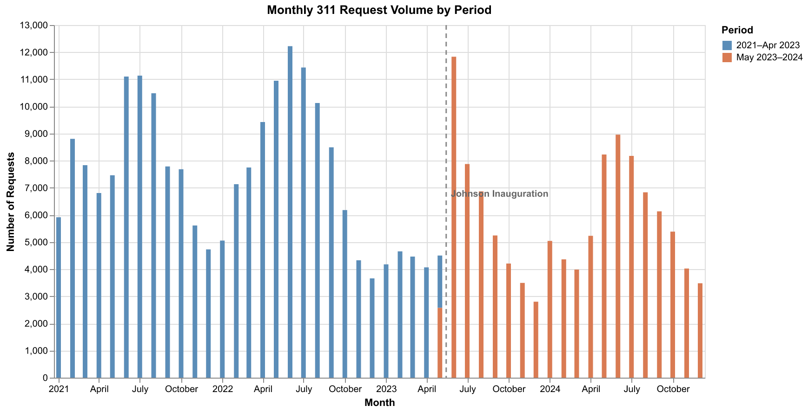
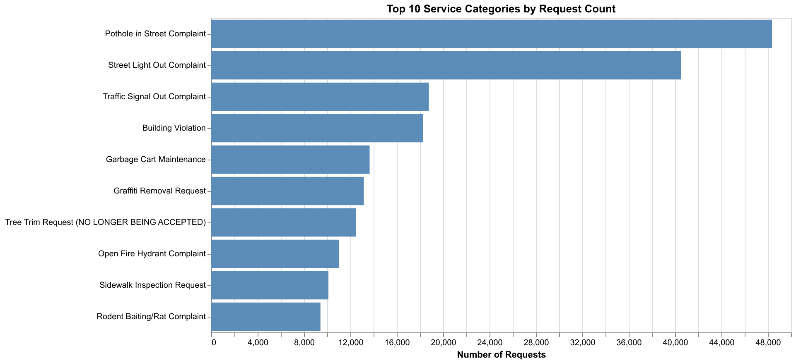

```{python}
#| label: setup
#| output: false
import os, json
import pandas as pd
import numpy as np
import altair as alt
import geopandas as gpd
import matplotlib.pyplot as plt

alt.data_transformers.disable_max_rows()

DERIVED = os.path.join("..", "data", "derived-data")
FIG_DIR = os.path.join("..", "figures")
os.makedirs(FIG_DIR, exist_ok=True)

JOHNSON = pd.Timestamp("2023-05-15")
BLUE = "#5B8DB8"
ORANGE = "#D97B53"
PERIOD_LABELS = ["2021–Apr 2023", "May 2023–2024"]

# df = pd.read_parquet(os.path.join(DERIVED, "311_cleaned.parquet"))
df = pd.read_csv(os.path.join(DERIVED, "311_cleaned.csv"))
df["created_date"] = pd.to_datetime(df["created_date"], errors="coerce")
df["year_month"] = df["created_date"].dt.to_period("M").dt.to_timestamp()
df["period"] = np.where(df["created_date"] < JOHNSON, "2021–Apr 2023", "May 2023–2024")
df["community_area"] = (
    pd.to_numeric(df["community_area"], errors="coerce").astype("Int64").astype(str)
)

ca = pd.read_csv(os.path.join(DERIVED, "community_area_stats.csv"))
ca["area_numbe"] = ca["area_numbe"].astype(str)
gdf = gpd.read_file(os.path.join(DERIVED, "community_areas.geojson"))
gdf["area_numbe"] = gdf["area_numbe"].astype(str)

PERIOD_SCALE = alt.Scale(domain=PERIOD_LABELS, range=[BLUE, ORANGE])
rule_df = pd.DataFrame({"date": [JOHNSON]})

def johnson_rule():
    r = alt.Chart(rule_df).mark_rule(
        strokeDash=[5, 4], color="#888", strokeWidth=1.5
    ).encode(x="date:T")
    t = alt.Chart(rule_df).mark_text(
        align="left", dx=5, dy=-8, fontSize=9, color="#666", fontWeight="bold"
    ).encode(x="date:T", text=alt.value("Johnson Inauguration"))
    return r + t
```

## Research Question

This project analyzes Chicago's 311 service delivery from 2021 to 2024, spanning the transition to Mayor Brandon Johnson's administration (inaugurated May 2023). We focus on four descriptive questions:

1. How did overall demand for city services change between 2021 and 2024?
2. Did service response times shift in level, trend, or variability around the mayoral transition?
3. How did disparities in service delivery across neighborhoods---particularly by income level---evolve over time?
4. Which service categories contributed most to observed changes in operational performance?

## Approach and Coding

**Data sources.** We combine two publicly available datasets: (1) **Chicago 311 Service Requests** from the City of Chicago Data Portal (Socrata API), containing 326,000+ records with request dates, completion dates, service categories, and geolocation; and (2) **American Community Survey (ACS) 5-Year Estimates** from the U.S. Census Bureau, providing population, income, and poverty rates at the census-tract level. We also use **Chicago Community Area Boundaries** (GeoJSON) for spatial aggregation.

**Data wrangling.** All processing is in `code/preprocessing.py`. Key steps include: filtering to 2021--2024, computing response times from created/closed dates, spatial-joining 311 requests to Chicago's 77 community areas via coordinates, aggregating ACS tracts to community areas via centroid-based joins, and constructing income quintiles for equity analysis.

**Challenges.** The raw dataset exceeds 300 MB and required paginated API downloads. A small fraction of records have negative response times (data entry errors), which we set to missing. The tract-to-community-area mapping required centroid-based spatial joins since no official crosswalk exists.

## Static Visualizations

Disclaimer: Due to space limitations in the final project write-up, not all visualizations could be included here. Additional graphs and their interpretations are available in generate_figures.pdf.

### Figure 1: Monthly Request Volume

```{python}
#| label: gen-fig1
#| output: false
vol = (df.groupby(["year_month", "period"]).size()
       .reset_index(name="requests")
       .sort_values("year_month"))

bars = alt.Chart(vol).mark_bar().encode(
    x=alt.X("year_month:T", title="Month"),
    y=alt.Y("requests:Q", title="Number of Requests"),
    color=alt.Color("period:N", scale=PERIOD_SCALE, title="Period"),
    tooltip=[
        alt.Tooltip("year_month:T", title="Month", format="%b %Y"),
        alt.Tooltip("requests:Q", title="Requests", format=","),
        alt.Tooltip("period:N", title="Period"),
    ],
).properties(width=600, height=260)
fig1 = (bars + johnson_rule())
fig1.save(os.path.join(FIG_DIR, "fig01_monthly_volume.png"), scale_factor=2)
```

{#fig-volume width=60%}

@fig-volume shows monthly request counts colored by administration period. Seasonal patterns are clear---summer months consistently see higher demand. The inauguration marker allows direct visual comparison of volume before and after the transition, revealing that overall demand remained relatively stable.

### Figure 2: Top Service Categories

```{python}
#| label: gen-fig2
#| output: false
tc = (df.groupby("sr_type").size()
      .reset_index(name="requests")
      .nlargest(10, "requests"))

fig2 = alt.Chart(tc).mark_bar(color=BLUE).encode(
    x=alt.X("requests:Q", title="Number of Requests"),
    y=alt.Y("sr_type:N", sort="-x", title="",
            axis=alt.Axis(labelLimit=400)),
    tooltip=[
        alt.Tooltip("sr_type:N", title="Service Type"),
        alt.Tooltip("requests:Q", title="Requests", format=","),
    ],
).properties(width=520, height=260)
fig2.save(os.path.join(FIG_DIR, "fig02_top_categories.png"), scale_factor=2)
```

{#fig-categories width=60%}

@fig-categories reveals that a small number of categories dominate the city's workload---pothole complaints and street light outages alone account for the majority of all 311 requests. Targeted improvements in these high-volume types would yield the greatest citywide impact.

### Figure 3: Response Time Shift---Which Services Got Faster or Slower?

```{python}
#| label: gen-fig3
#| output: false
pre_s = df[df["period"] == "2021–Apr 2023"].groupby("sr_type")["response_time_days"].median()
post_s = df[df["period"] == "May 2023–2024"].groupby("sr_type")["response_time_days"].median()
chg = (post_s - pre_s).dropna().reset_index()
chg.columns = ["service_type", "change_days"]
chg["count"] = df.groupby("sr_type").size().reindex(chg["service_type"]).values
chg = chg[chg["count"] > 500].sort_values("change_days")
chg["direction"] = chg["change_days"].apply(
    lambda x: "Faster" if x < -1 else ("Slower" if x > 1 else "Stable"))
show = pd.concat([chg.head(8), chg.tail(8)]).drop_duplicates()

shift_bars = alt.Chart(show).mark_bar().encode(
    x=alt.X("change_days:Q", title="Change in Median Wait (days)"),
    y=alt.Y("service_type:N",
            sort=alt.EncodingSortField(field="change_days", order="ascending"),
            title="", axis=alt.Axis(labelLimit=400)),
    color=alt.Color("direction:N",
                    scale=alt.Scale(
                        domain=["Faster", "Stable", "Slower"],
                        range=["#27ae60", "#bbb", "#c0392b"]),
                    title="Direction"),
)
zero = alt.Chart(pd.DataFrame({"x": [0]})).mark_rule(color="#333", strokeWidth=1).encode(x="x:Q")
fig3 = (shift_bars + zero).properties(width=520, height=300)
fig3.save(os.path.join(FIG_DIR, "fig03_response_shift.png"), scale_factor=2)
```

{#fig-shift width=60%}

@fig-shift compares median response times before and after the administration change for the service types that improved or worsened the most. Several categories saw meaningful declines in wait time, while others---particularly building-related complaints---experienced longer delays.

### Figure 4: Median Wait by Income Quintile and Period

```{python}
#| label: gen-fig4
#| output: false
Q_ORDER = ["Q1 (Lowest)", "Q2", "Q3", "Q4", "Q5 (Highest)"]
f_q = df[df["income_quintile"].notna()].copy()
eq = (f_q.groupby(["income_quintile", "period"])["response_time_days"]
      .median().reset_index())
eq.columns = ["income_quintile", "period", "median_wait"]

fig4 = alt.Chart(eq).mark_bar().encode(
    x=alt.X("income_quintile:N", title="Income Quintile",
            sort=Q_ORDER, axis=alt.Axis(labelAngle=0)),
    y=alt.Y("median_wait:Q", title="Median Wait (days)"),
    color=alt.Color("period:N", scale=PERIOD_SCALE, title="Period"),
    xOffset="period:N",
    tooltip=[
        alt.Tooltip("income_quintile:N", title="Income Quintile"),
        alt.Tooltip("period:N", title="Period"),
        alt.Tooltip("median_wait:Q", title="Median Wait (days)", format=".1f"),
    ],
).properties(width=520, height=260)
fig4.save(os.path.join(FIG_DIR, "fig04_quintile_wait.png"), scale_factor=2)
```

{#fig-equity width=60%}

@fig-equity shows that lower-income neighborhoods consistently face longer waits. The gap persists across both periods, and in several quintiles response times increased after the transition---suggesting that equity-weighted resource allocation may be needed.

## Streamlit Dashboard

We built an interactive Streamlit dashboard deployed at **[request2resolution.streamlit.app](https://request2resolution.streamlit.app)**, organized into five tabs: **Overview** (monthly volume trends and top service categories), **Response Times** (service-level drill-down with period comparisons), **Equity & Income** (quintile wait-time comparisons and heatmaps), **Geography** (interactive choropleth with selectable metrics), and **Neighborhoods** (deep-dive by community area). Users can filter by year, service type, income quintile, and administration period to explore patterns beyond what static figures capture.

## Policy Implications

- **Service concentration**: A few high-volume categories dominate demand; targeted process improvements there would yield the greatest citywide impact.
- **Equity gaps**: Slow requests disproportionately concentrate in lower-income neighborhoods, suggesting resource allocation formulas may need to better weight neighborhood need.
- **Spatial variation**: Performance changes varied widely by community area, indicating neighborhood-targeted interventions over blanket policy changes.

These descriptive findings identify *where* problems exist, providing a foundation for deeper causal evaluation.

## AI Use

We used Claude (Anthropic) as a learning and debugging assistant in ways that supported rather than replaced my own understanding and implementation. We used AI to help structure parts of the code and writeup. All policy reasoning, data preparation, interpretation of results, and final implementation decisions were completed and verified by us. We used AI in a way consistent with the course guidance to enhance learning, clarify concepts, and improve implementation efficiency rather than to substitute for our own work.